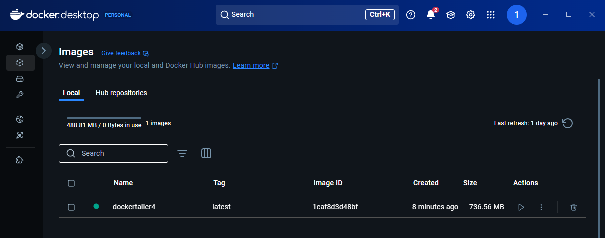
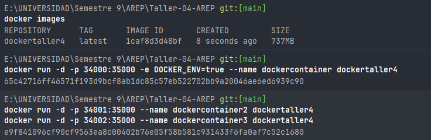
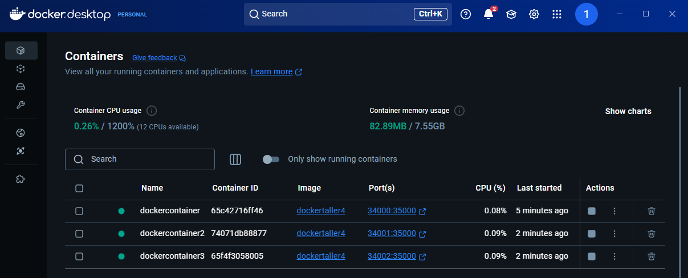
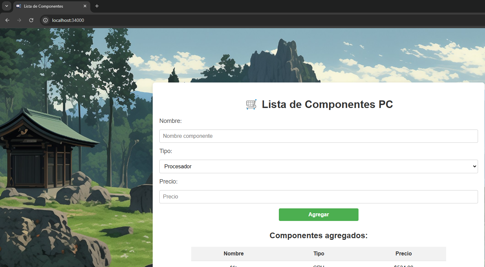
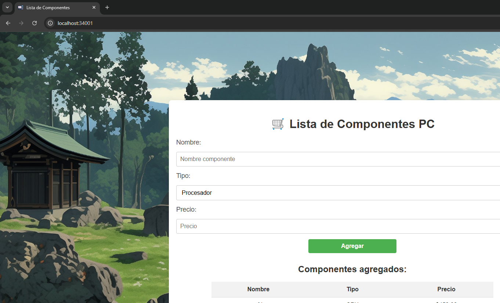
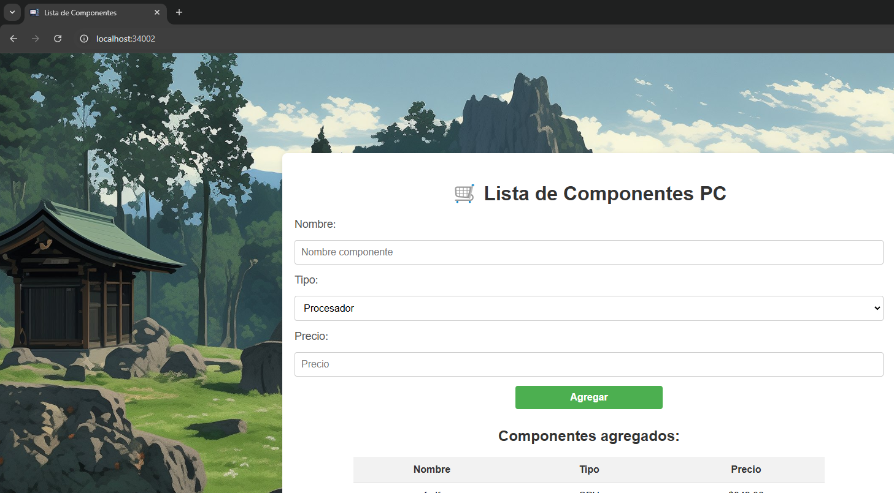

# AREP Taller 4 💻
# Modularización con Virtualización e Introducción a Docker

Este proyecto es un framework web ligero desarrollado en Java que permite a los desarrolladores crear aplicaciones web con servicios REST y gestionar archivos estáticos (HTML, CSS, JavaScript, imágenes, etc.). El framework proporciona herramientas para definir rutas REST usando funciones lambda, extraer parámetros de consulta de las solicitudes y especificar la ubicación de archivos estáticos. Además, se ha mejorado para manejar solicitudes concurrentes y asegurar un cierre elegante del servidor.

En la aplicación web podrás añadir los componentes que quieres y te hacen falta para armar tu computador deseado. 😎


## Demo del Proyecto

<video src="https://github.com/AnaDuranB/Taller-04-AREP/imgss/taller-04-arep.mp4" controls width="100%"></video>

---
## Prerequisites ⚙️

Para ejecutar este proyecto necesitas instalar lo siguiente:

```
- Java 17 o superior
- Maven 3.8.1 o superior (la versión en el entorno donde fue creado es la 3.9.9)
- Un navegador web
```

En caso de no tener maven instalado, aquí encuentras un tutorial [Maven](https://dev.to/vanessa_corredor/instalar-manualmente-maven-en-windows-10-50pb).

---
## Project Architecture

El proyecto sigue una arquitectura cliente-servidor con un backend en Java y un frontend en HTML, CSS y JavaScript.

Componentes principales de tu arquitectura:

1. **Servidor web en Java (MicroSpringBoot)**
    - Maneja las solicitudes HTTP.
    - Usa controladores (@RestController) para definir endpoints.
    - Responde con archivos estáticos o datos JSON.
2. **Sistema de ruteo y anotaciones personalizadas**
    - Implementa una versión ligera de Spring con @GetMapping, @PostMapping, etc.
    - Permite definir endpoints de manera declarativa.
3. **Frontend basado en HTML, CSS y JavaScript**
    - Se comunica con el backend mediante fetch().
    - Carga y muestra los datos de los componentes en la UI.
4. **Despliegue en contenedores Docker**
    - Se generan imágenes Docker para ejecutar la aplicación.
    - Se pueden levantar varias instancias en AWS.


---
## Project Structure and Class Design

```
src/
  main/
    java/
      org/
        example/
            annotations/               # Anotaciones personalizadas
                GetMapping.java
                PostMappingjava
                RequestBody.java
                Requestparamjava
                RestControllerjava
            controller/
                ComponentController.java   # Controlador para manejar componentes
                GreetingController.java    # Controlador de ejemplo
            model/
                Component.java        # Modelo de datos para componentes
            server/
                HttpServer.java       # Clase principal del servidor
                Request.java          # Maneja las solicitudes HTTP
                Response.java         # Maneja las respuestas HTTP
          MicroSpringBoot.java        # Clase principal del framework IoC
    webapp/                    # Carpeta de archivos estáticos             
        index.html              # Archivo HTML
        styles.css              # Archivo CSS
        script.js               # Archivo JavaScript
  test/
    java/                       # Pruebas unitarias
pom.xml                         # Archivo de configuración de Maven
README.md                       # Documentación del proyecto
```

#### 1. **Servidor HTTP (`HttpServer.java`)**

Clase principal que inicia el servidor, escucha las solicitudes y las distribuye a los controladores correspondientes.

#### 2. **Manejador de Solicitudes (`RequestHandler.java`)**

Encargado de analizar las solicitudes HTTP y responder apropiadamente según la ruta.

#### 3. **Manejo de Archivos Estáticos (`StaticFileHandler.java`)**

Sirve archivos HTML, CSS, JS e imágenes desde el directorio configurado.

#### 4. **Gestión de Componentes (`ComponentController.java`)**

Implementa la API REST para agregar y listar componentes de computadoras en memoria.

#### 5. **Modelo de Datos (`Component.java`)**

Representa los datos de un componente (nombre, tipo y precio) y se almacena temporalmente en una lista en memoria.

---

## Build and Deploy with Docker: 🐳

### Generación de Imágenes Docker:

Para construir la imagen del servidor:

```bash
docker build --tag dockertaller4 .
```



### Ejecución de los Contenedores:

1. Para ejecutar los servicios de forma local con Docker:

```bash
docker run -d -p 34000:35000 -e DOCKER_ENV=true --name dockercontainer dockertaller4
```



Aplicación corriendo correctamente:

- 34000


- 34001


- 34002



2. Subimos la imagen a DockerHub, a nuestro respectivo repositorio.


## Despliegue en AWS con EC2

1. Crear una instancia EC2.


2. Configurar el puerto en el grupo de seguridad.


3. Conectarse vía SSH.


4. Instalar Docker en la instancia:

```bash
sudo yum update -y
sudo yum install docker
sudo service docker start
```

5. Transferir las imágenes a la instancia y ejecutarlas con los mismos comandos anteriores. En este caso:
   
```bash
docker run -d -p 42000:35000 -e DOCKER_ENV=true --name dockercontaineraws 1000380607/taller04arep
```

Abrimos el link del despliegue:


---
### Main features

1. **Definición de Rutas REST**:
    - Permite definir rutas REST usando el método `get()` y `post()`.
    - Soporta el uso de funciones lambda para manejar solicitudes y respuestas.
        
2. **Extracción de Parámetros de Consulta**:
    - Proporciona un mecanismo para extraer parámetros de consulta de las URLs.
        
3. **Gestión de Archivos Estáticos**:
    - Permite especificar la carpeta donde se encuentran los archivos estáticos usando el método `staticfiles()`.

4. **Concurrencia**:
    - El servidor ahora maneja solicitudes concurrentes utilizando un `ExecutorService` con un pool de hilos.
    - Esto permite que el servidor atienda múltiples solicitudes simultáneamente sin bloquearse.
    - Ejemplo:

        ```java
        private static final int THREADS = 10;
        private static ExecutorService threadPool = Executors.newFixedThreadPool(THREADS);
        ```

5. **Cierre Elegante**:
    - El servidor puede detenerse de manera segura, cerrando todos los hilos en ejecución y liberando recursos.
    - Ejemplo:

        ```java
        public static void stop() {
            running = false;
            threadPool.shutdown();
            try {
                if (!threadPool.awaitTermination(60, TimeUnit.SECONDS)) {
                    threadPool.shutdownNow();
                }
            } catch (InterruptedException e) {
                threadPool.shutdownNow();
            }
            System.out.println("Servidor detenido correctamente.");
        }
        ```
6. **Escalabilidad y Mantenibilidad**:
    - Diseñado para ser ligero y fácil de extender.
    - Ideal para aplicaciones pequeñas y medianas que requieren un servidor HTTP personalizado.

---

### Installing ⚙️

Sigue estos pasos si solo quieres usar la aplicación localmente en una sola instancia:

1. Clona este repositorio:

```
git clone https://github.com/AnaDuranB/Taller-04-AREP.git
```

2. Ingresa al directorio del proyecto:

```
cd Taller-04-AREP
```

En caso de no contar con un IDE de java que se haga responsable de la compilación y ejecución:

3. Compila el proyecto con Maven:

```
mvn clean compile
```

4. Ejecuta el servidor:

```
java -cp target/classes org.example.MicroSpringBoot
```


5. Abre tu navegador y accede a:

```
http://localhost:35000/
```

---

---

## Running the tests


Para ejecutar las pruebas automatizadas:

```
mvn test
```


Estas pruebas verifican la correcta respuesta del servidor ante diferentes solicitudes.


Ejemplo con `curl`:

```bash
curl http://localhost:35000/hello?name=Ana
curl -X POST http://localhost:35000/api/components -d '{"name": "AMD RYZEN 5 5600X", "type": "CPU", "price": 769999}'
```

## Built With

- [Java SE](https://www.oracle.com/java/) - Lenguaje de programación
- [Maven](https://maven.apache.org/) - Herramienta de gestión de dependencias y construcción

## Authors

- Ana Maria Duran - *AREP* *Taller 4* - [AnaDuranB](https://github.com/AnaDuranB)
